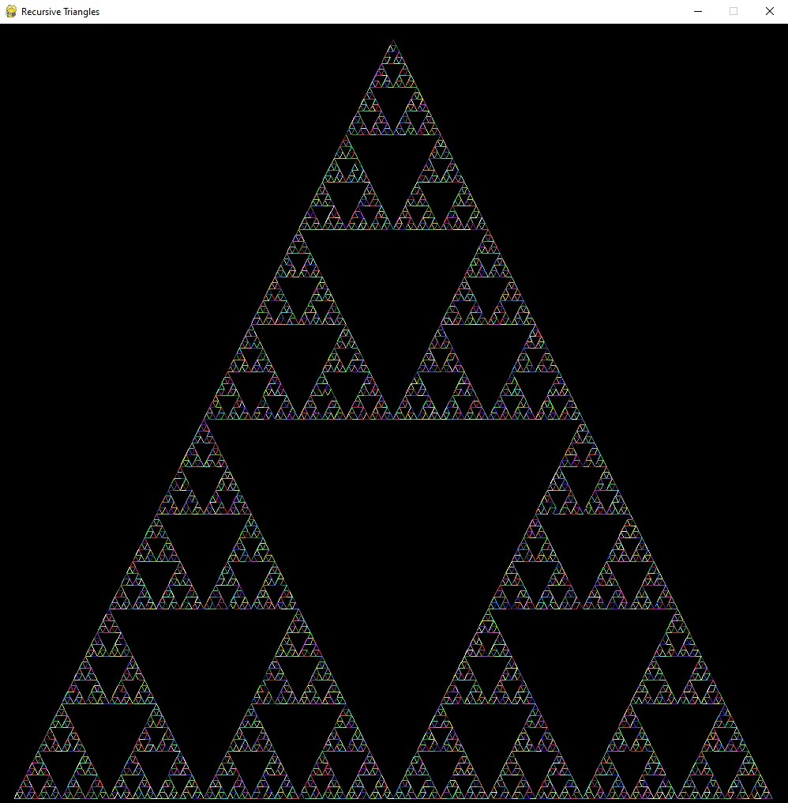

# RecursiveTriangles
This project is meant for me to familiarize myself with basic python graphics and with using SSH for GitHub. The program should display a window and it will draw a triangle and then will proceed to recursively draw smaller triangles inside of it. Every line will be given a randomly generated color.

## How to run
Just navigate to the directory that the file is in and type "python RecursiveTriangle.py" and it will generate the window and will draw each line.

## Images

